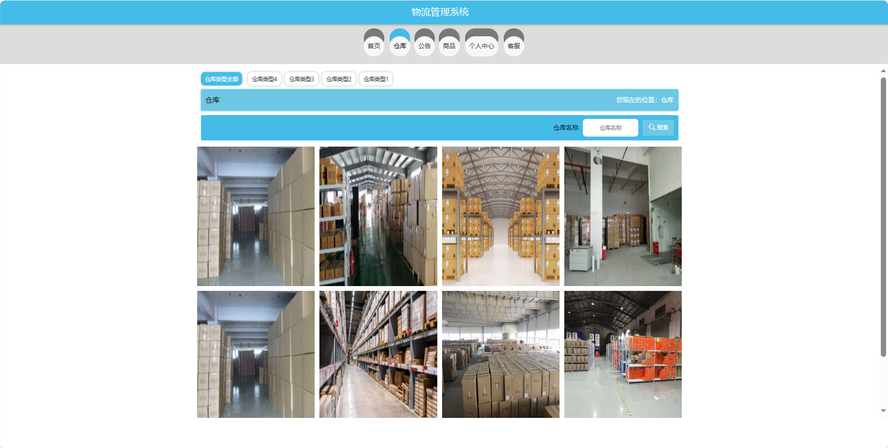
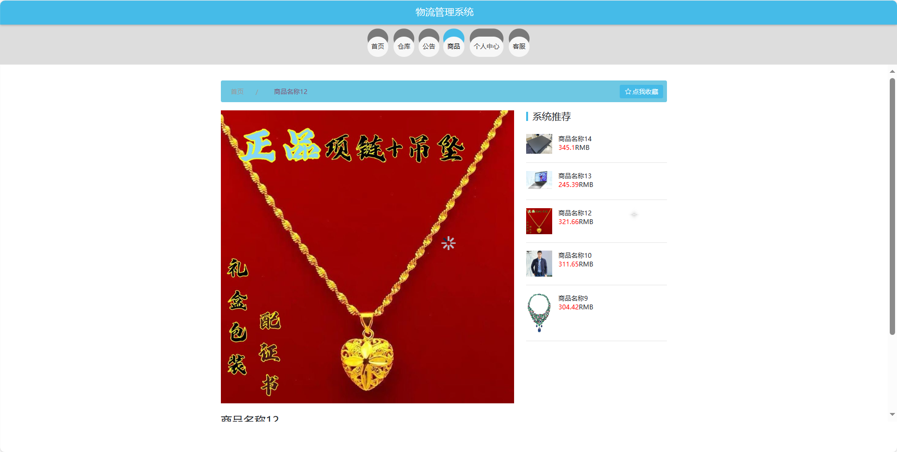
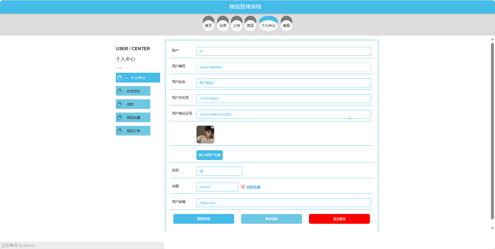
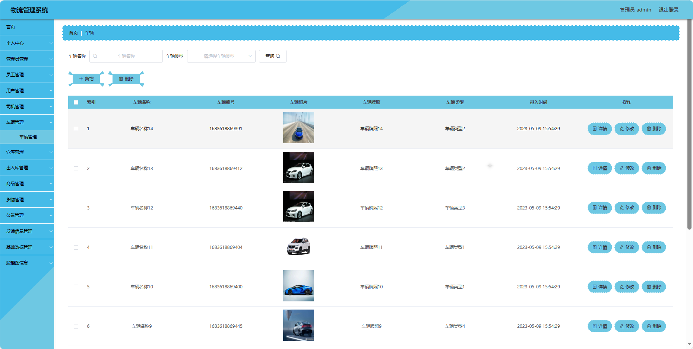
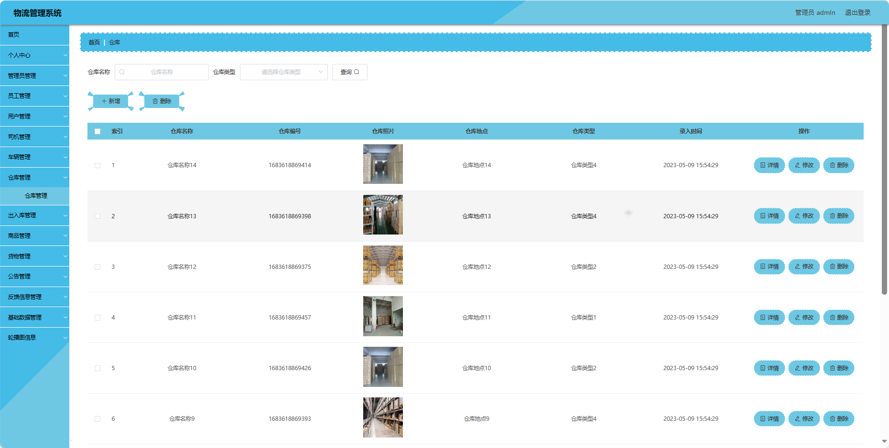
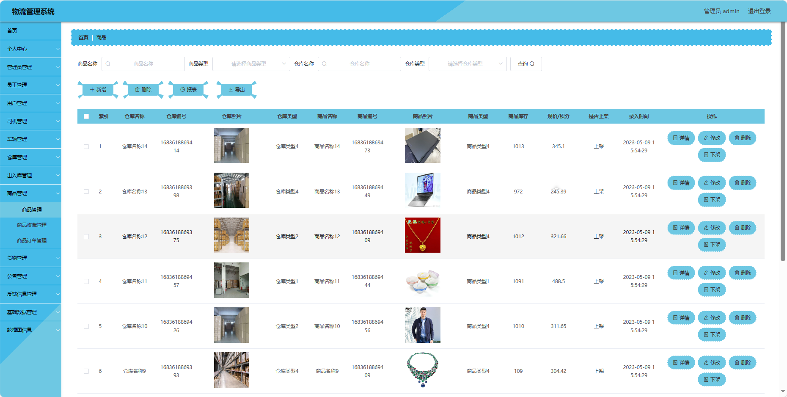

## 基于SpringBoot的物流管理系统(程序+报告)

###  获取sql数据库文件: 从戎源码网 (https://armycodes.com/) QQ: 386869957 QQ群: 377586148
###  所有系统地址: (https://github.com/YuLin-Coder/AllProjectCatalog) 
###  所有项目以及源代码本人均调试运行无问题 可支持远程安装部署调试、定制修改、代码讲解

## 项目介绍
基于SpringBoot的物流管理系统，系统包含三种角色：管理员、用户,员工主要功能如下。

### 【管理员】:
首页：查看物流管理系统整体概况和关键数据。
个人中心：修改密码、管理个人信息。
管理员管理：审核和管理注册管理员用户的信息。
员工管理：审核和管理注册员工用户的信息。
用户管理：审核和管理注册普通用户的信息。
司机管理：管理系统中的司机信息，添加、删除等。
车辆管理：管理系统中的车辆信息，添加、删除等。
仓库管理：管理系统中的仓库信息，添加、删除等。
出入库管理：监管和管理货物的出入库情况，记录和查询。
商品管理：监管和管理系统中的商品信息，上架、下架等。
货物管理：查看和管理货物的信息，种类和数量等。
公告管理：发布、编辑和删除系统的通知和公告。
反馈信息管理：查看和处理用户的反馈信息。
基础数据管理：管理系统的基础数据，库类型、车辆类型、公告类型、货物类型、商品类型、出入库类型等。
轮播图信息：管理系统首页的轮播图。

### 【员工】:
首页：查看物流管理系统的主要信息和推荐内容。
个人中心：管理个人信息。
司机管理：查看和管理司机信息，包括行车记录等。
车辆管理：查看和管理车辆信息，包括维护记录等。
仓库管理：查看和管理仓库信息，包括库存情况等。
出入库管理：记录和处理货物的出入库情况，包括入库、出库等。
商品管理：查看和管理商品信息，包括上架、下架等。
货物管理：查看和管理货物的信息，包括种类和数量等。
公告管理：查看和阅读系统发布的通知和公告。
轮播图信息：查看和管理系统首页的轮播图。

### 【用户】:
首页：浏览物流管理系统的主要信息。
仓库：查看仓库相关信息，包括存储货物的情况。
公告：阅读系统发布的相关通知和公告。
商品：浏览系统中的商品信息，包括详细描述和价格。
个人中心：管理个人信息，查看订单历史记录等。
客服：与系统提供的客服进行实时交流。

## 项目技术
- 编程语言：Java
- 数据库：MySQL
- 项目管理工具：Maven
- 前端技术：HTML、CSS、JavaScript、Jquery、Vue
- 后端技术：Spring、SpringMVC、MyBatis

## 运行环境
- JDK版本：JDK1.8及以上
- 开发工具：IDEA、Ecplise、Myecplise都可以
- 数据库: MySQL5.7及以上
- Maven：maven3.0及以上
- Node：14.14.0及以上

## 运行截图

